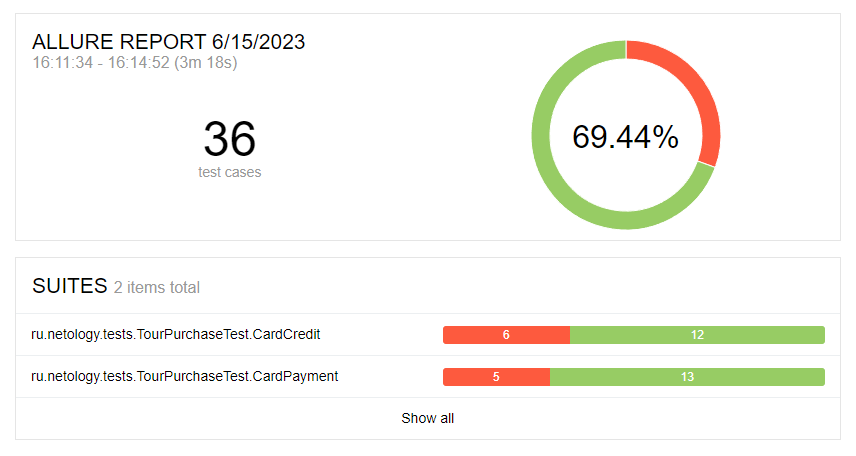
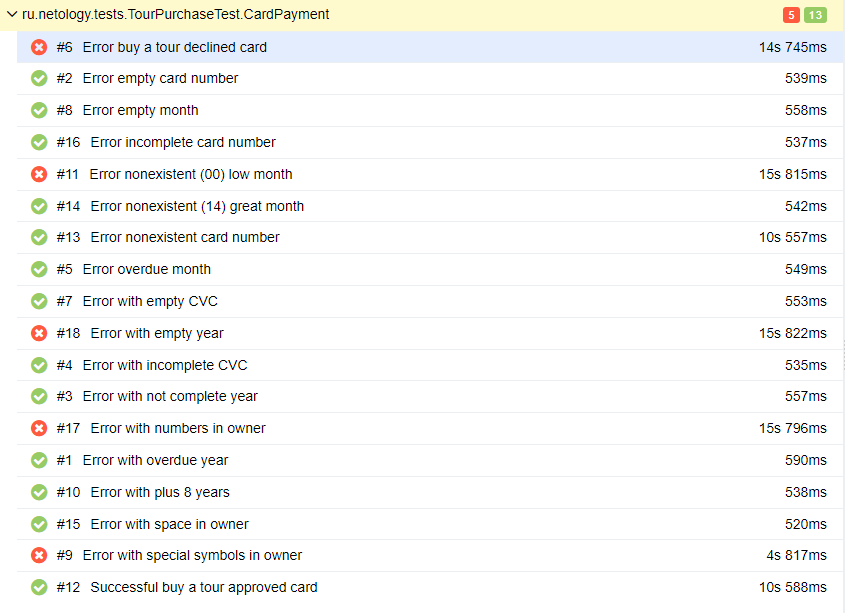
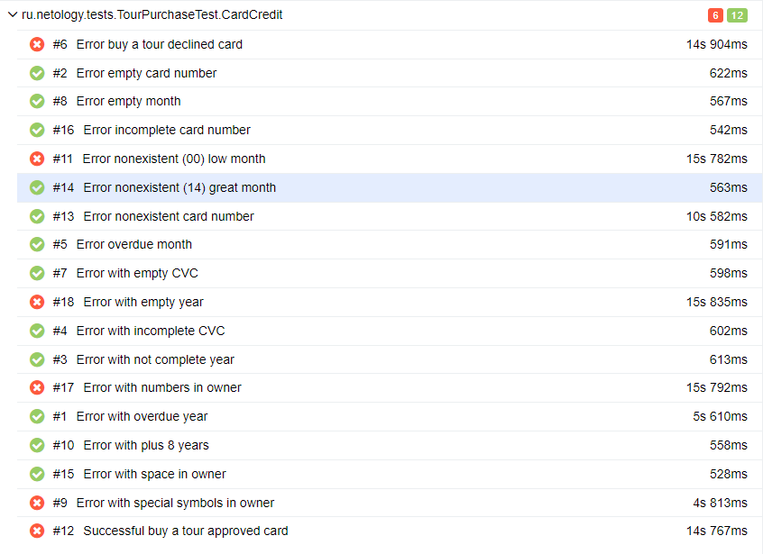

# Отчёт о проведённом тестировании

### Краткое описание
В ходе работы над дипломным проектом было проведено тестирование приложения веб-сервиса, который предлагает купить тур по дебетовой карте или в кредит.
Были написаны автоматизированные тесты для сервиса, а также протестированы позитивные и негативные сценарии покупки тура, из них:
* успешная операция оплаты покупки по карте и в кредит;
* отказ банка в проведении операции оплаты покупки по карте и в кредит;
* негативные проверки полей: невалидные значения, незаполненные поля.

Данные тесты были запущены для двух СУБД: MySQL и PostgreSQL.

### Количество тест-кейсов
Общее количество тест-кейсов - 36

### Процент успешных и не успешных тест-кейсов
* Успешных - 25(69,44%)
* Неуспешных - 11(30,55%)

#### Отчет по результатам тестирования Allure:
Отчёт Overview:

Отчёт Suites:

CardPayment:

CardCredit:

### Найденные дефекты
1. [При оплате по карте не выдается сообщение об ошибке при вводе одной буквы в поле "Владелец" и заявка успешно отправляется.]
2. [При покупке в кредит не выдается сообщение об ошибке при вводе одной буквы в поле "Владелец" и заявка успешно отправляется.]
3. [При оплате по карте со статусом DECLINED заявка успешно отправляется.]
4. [При покупке в кредит по данным карты со статусом DECLINED заявка успешно отправляется.]
5. [При оплате по карте не выдается сообщение об ошибке при вводе в поле "Месяц" значение "00" следующего года.]
6. [При покупке в кредит не выдается сообщение об ошибке при вводе в поле "Месяц" значение "00" следующего года.]
7. [При оплате по карте не выдается сообщение об ошибке при вводе цифр в поле "Владелец" и заявка успешно отправляется.]
8. [При покупке в кредит не выдается сообщение об ошибке при вводе цифр в поле "Владелец" и заявка успешно отправляется.]
9. [При оплате по карте не выдается сообщение об ошибке при вводе более 60 символов в поле "Владелец" и заявка успешно отправляется.]
10. [При покупке в кредит не выдается сообщение об ошибке при вводе более 60 символов в поле "Владелец" и заявка успешно отправляется.]
11. [При оплате по карте не выдается сообщение об ошибке при вводе спецсимволов в поле "Владелец" и заявка успешно отправляется.]
12. [При покупке в кредит не выдается сообщение об ошибке при вводе спецсимволов в поле "Владелец" и заявка успешно отправляется.]
 